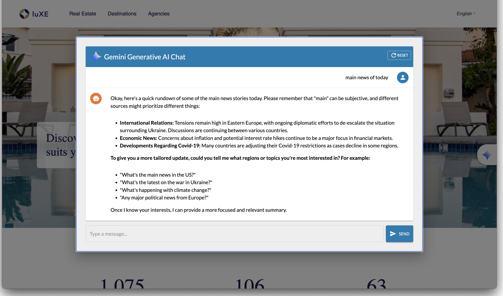

# Gemini AI Prompt Module

**Gemini AI Prompt** is a Jahia V8.2.0.6 module that integrates with **Google Gemini AI** to enhance content rendering. It utilizes Jahia's **render filter** mechanism to modify or augment content dynamically using AI. The module is implemented as an **OSGi component** and requires configuration with an API key.


## Table of Contents

- [Features](#Features)
- [Screenshots](#Screenshots)
- [Installation](#Installation)
- [Usage](#Usage)
- [Configuration](#Configuration)
- [Technologies](#Technologies)
- [Troubleshooting](#Troubleshooting)
- [License](#License)
- [Contributing](#Contributing)
- [Acknowledgments](#Acknowledgments)


## Features

- Seamless integration with Google Gemini AI (React Front-End integration)
- Multi-language support (EN, FR, ES, DE)
- Persistent chat history (localStorage)
- Reset chat history functionality
- Fully responsive UI using **Material-UI**
- **i18n translation support**

---
## Screenshots

---

## Installation

### 1. Clone the Repository
```sh
git clone https://github.com/smonier/gemini-ai-prompt.git
cd gemini-ai-prompt
```

### 2. Install Dependencies
```sh
npm install
```

### 3. Configure Environment Variables
Environment variables are set in the `org.jahia.se.modules.geminiPrompt.cfg` file in the Jahia Module:
```sh
gemini.apitoken=your_google_gemini_api_key
gemini.model=the_chosen_model
```

### 4. Build the Application
```sh
mvn clean install
```
Deploy the module into your Jahia instance using module admnistration UI and activate it for the desire web project

## Usage

### 1. Chat with Gemini AI
- Click on the Gemini Logo on the right side of the screen in Live mode or Edit mode
- Enter a message in the input field.
- Click **"Send"** or press `Enter`.
- Gemini AI will generate a response.

### 2. Reset Chat
- Click the **Reset** button in the top-right corner to clear the conversation.

### 3. Change Language
- The Gemini chat is available in `English`, `French`, `Spanish`, and `German`.

## Configuration

### Environment Variables
Environment variables are set in the `org.jahia.se.modules.geminiPrompt.cfg` file in the Jahia Module:
```sh
gemini.apitoken=your_google_gemini_api_key
gemini.model=the_chosen_model
```
### i18n Translation
Modify **`locales/*.json`** to customize translations.

## Technologies

- **React.js** (UI Framework)
- **Material-UI (`@mui/material`)**
- **Google Generative AI SDK**
- **i18next** (Internationalization)
- **localStorage** (Chat history persistence)


## Troubleshooting

### API Not Responding?
- Ensure your **Google Gemini API key** is correct.
- Check for **network issues**.
- Try again later (API rate limits may apply).

### Translation Not Working?
- Restart the app after modifying **i18n JSON files**.

### Messages Not Persisting?
- Ensure **localStorage** is enabled in your browser.

## Contributing

1. Fork the repository
2. Create a new branch (`git checkout -b feature-branch`)
3. Commit changes (`git commit -m "Add new feature"`)
4. Push to GitHub (`git push origin feature-branch`)
5. Open a **Pull Request**

## License

This project is **MIT Licensed**. See [`LICENSE`](LICENSE) for details.

## Acknowledgments

- **Google Gemini AI** for the API.
- **Material-UI** for the UI components.
- **i18next** for language support.
- **Hervé Duchesne** https://github.com/hduchesne

Enjoy using Gemini AI Prompt Module.

